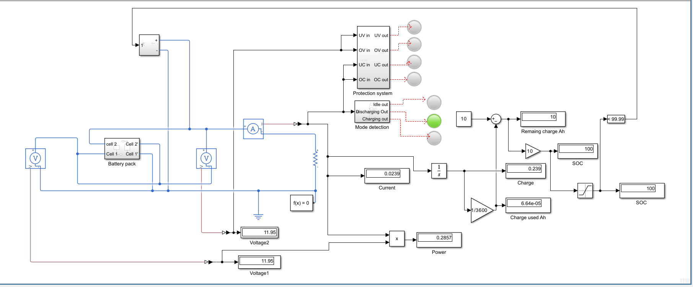
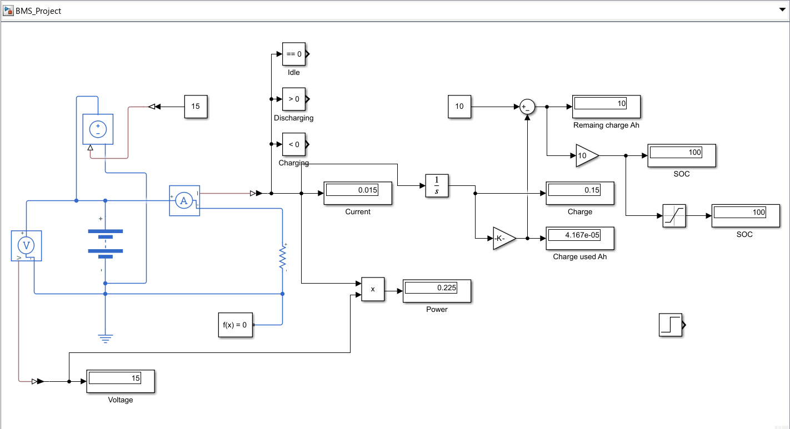
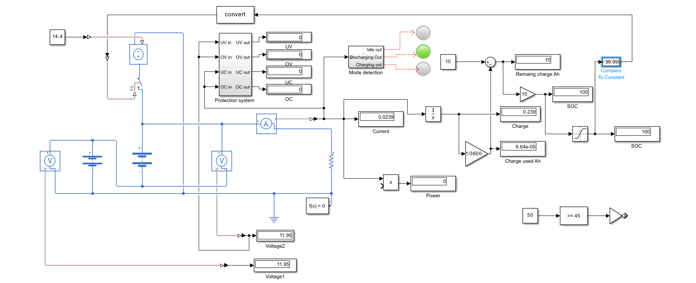
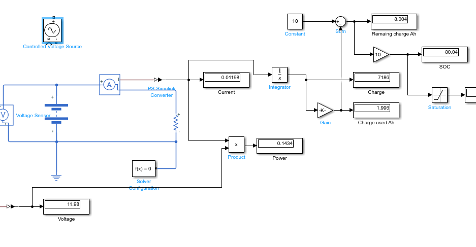

# EV Battery Management System (BMS) using MATLAB Simulink

## Overview
This project implements a Battery Management System (BMS) in MATLAB Simulink for monitoring and protecting an EV battery pack.

## Features
- Battery Pack Modeling
- State of Charge (SOC) Estimation
- Under Voltage Protection
- Over Voltage Protection
- Under Current Protection
- Over Current Protection
- Temperature Protection
- Charging/Discharging Mode Detection

## Software Used
- MATLAB R2023a
- Simulink
- Simscape

## Project Structure
- EV_Battery_Management_System.slx
- BMS_Model.png
- Simulation_Output.png

## Future Improvements
- Cell balancing
- State of Health (SOH) estimation
- CAN communication
- Battery thermal management

## Project Images

### Complete BMS Model

### Charging Circuit

### Protection and Mode Detection

### SOC Estimation

## Author
Aditya Raj Shekhar
B.Tech Electrical & Electronics Engineering
